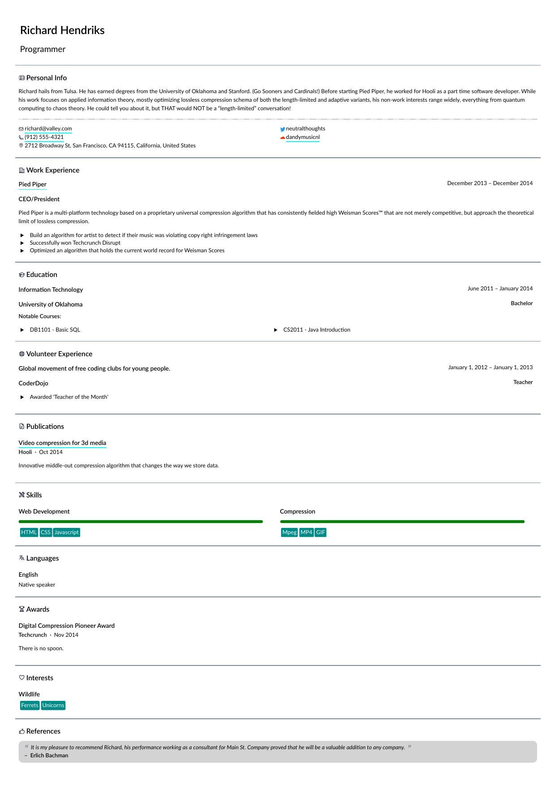

# jsonresume-theme-relaxed

A [JSON Resume][] theme optimised for PDF output.

[JSON Resume]: https://jsonresume.org/

## Installation

```bash
git clone https://github.com/ObserverOfTime/jsonresume-theme-relaxed
cd jsonresume-theme-relaxed && npm install
```

## Create your resume

Create a `resume.json` file according to the [schema][],
build it [online][resume-builder], or export it from [LinkedIn][json-resume-exporter].

<details>

<summary>Click here for details</summary>

| Section | Field | Required | Line breaks (`\n`) | Notes |
|:---:|:---:|:---:|:---:|:---:|
| `basics` | `name` | **Yes** | No | Must be present. |
|  | `label` | No | No |  |
|  | `image` | No | No |  |
|  | `summary` | No | **Yes** |  |
| `basics.location` | `address` | No | No |  |
|  | `city` | No | No |  |
|  | `postalCode` | No | No |  |
|  | `region` | No | No |  |
|  | `countryCode` | **Yes** | No |  |
| `basics.profiles[]` | `url` | No | No |  |
|  | `network` | **Yes** | No |  |
|  | `username` | **Yes** | No |  |
| `work[]` | `website` | No | No |  |
|  | `company` | **Yes** | No |  |
|  | `location` |  |  | _Unsupported._ |
|  | `description` |  |  | _Unsupported._ |
|  | `position` | **Yes** | No |  |
|  | `summary` | No | **Yes** |  |
|  | `startDate` | No | No | `YYYY-MM` / `YYYY-MM-DD` |
|  | `endDate` | No | No | `YYYY-MM` / `YYYY-MM-DD`<br>Requires `startDate`. |
|  | `highlights[]` | No | No |  |
| `education[]` | `url` | No | No |  |
|  | `area` | **Yes** | No |  |
|  | `institution` | **Yes** | No |  |
|  | `studyType` | **Yes** | No |  |
|  | `startDate` | No | No | `YYYY-MM` / `YYYY-MM-DD` |
|  | `endDate` | No | No | `YYYY-MM` / `YYYY-MM-DD`<br>Requires `startDate`. |
|  | `score` | No | No |  |
|  | `courses[]` | No | No |  |
|  | `url` | No | No |  |
|  | `summary` | **Yes** | No | Should be the event name. |
|  | `organization` | **Yes** | No |  |
|  | `position` | **Yes** | No |  |
|  | `startDate` | No | No | `YYYY-MM-DD` |
|  | `endDate` | No | No | `YYYY-MM-DD`<br>Requires `startDate`. |
|  | `highlights[]` | No | No |  |
| `projects[]` | `url` | No | No |  |
|  | `name` | **Yes** | No |  |
|  | `type` |  |  | _Unsupported._ |
|  | `roles[]` | No | No |  |
|  | `entity` | No | No | Requires `roles[]`. |
|  | `description` | No | **Yes** |  |
|  | `startDate` | No | No | `YYYY-MM-DD` |
|  | `endDate` | No | No | `YYYY-MM-DD`<br>Requires `startDate`. |
|  | `highlights[]` | No | No |  |
|  | `keywords[]` | No | No |  |
| `publications[]` | `website` | No | No |  |
|  | `name` | **Yes** | No |  |
|  | `publisher` | **Yes** | No |  |
|  | `summary` | No | **Yes** |  |
|  | `releaseDate` | **Yes** | No | `YYYY-MM` / `YYYY-MM-DD` |
|  | `url` | No | No |  |
|  | `name` | **Yes** | No |  |
|  | `issuer` | **Yes** | No |  |
|  | `date` | **Yes** | No | `YYYY-MM` / `YYYY-MM-DD` |
| `skills[]` | `name` | **Yes** | No |  |
|  | `level` | **Yes** | No | "master" / "advanced" /<br>"intermediate" / "beginner" |
|  | `keywords[]` | No | No |  |
| `languages[]` | `language` | **Yes** | No |  |
|  | `fluency` | **Yes** | **Yes** |  |
| `awards[]` | `title` | **Yes** | No |  |
|  | `awarder` | **Yes** | No |  |
|  | `summary` | No | **Yes** |  |
|  | `date` | **No** | No | `YYYY-MM` / `YYYY-MM-DD` |
| `interests[]` | `name` | **Yes** | No |  |
|  | `keywords[]` | No | No |  |
| `references[]` | `name` | **Yes** | No |  |
|  | `reference` | **Yes** | **Yes** |  |
| `meta` | `canonical` | No | no |  |
|  | `lastModified` | No | No |  |
|  | `version` | No | No |  |
|  | `x-lang` | No | No | Language (default: "en").<br>_Non-standard._ |
|  | `x-size` | No | No | Font size (default: "10pt").<br>_Non-standard._ |

_All sections (except for `basics`) are optional._<br>
_Fields are only required if the section is present._

</details>

Supported languages:
  - English ("en")
  - Greek ("el")
  - German ("de")
  - French ("fr")

[schema]: https://jsonresume.org/schema/
[resume-builder]: https://resume-builder.js.org/en/build
[json-resume-exporter]: https://chrome.google.com/webstore/detail/json-resume-exporter/caobgmmcpklomkcckaenhjlokpmfbdec

## Export to PDF

```bash
npm run build -- resume.pdf
```

## Sample



## Credits

The theme was made using [HTMLS][] & [Stylus][],
with icons from [Heroicons][] & [Simple Icons][]
and the [Lato][] font.

[HTMLS]: https://github.com/Daiz/htmls
[Stylus]: https://stylus-lang.com/
[Heroicons]: https://heroicons.dev/
[Simple Icons]: https://simpleicons.org/
[Lato]: https://www.latofonts.com/

## License

> This Source Code Form is subject to the terms of the Mozilla Public License, v. 2.0.
